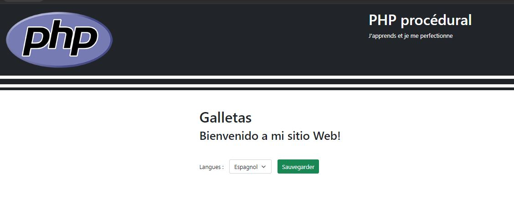

# COOKIES  
Vous devez créer un site permettant à l'utilisateur de choisir une langue d'affichage pour le site.  
Vous devez stocker la langue choisie par l'utilisateur dans un cookie, afin de lui permettre de   
retrouver cette langue ultérieurement  
## consignes :
Écrivez un script PHP qui affiche une page d'accueil avec un formulaire permettant à l'utilisateur de choisir  
une langue d'affichage. Lorsque le formulaire est soumis, la langue choisie par l'utilisateur est stockée dans un cookie et l'utilisateur
est redirigé vers la meme page d'accueil, qui doit maintenant etre affichée dans la langue choisie.  
&nbsp;&nbsp; 

    
&nbsp;&nbsp; 

&nbsp;&nbsp; 
Par défaut le site est en français si aucune langue n'a été sélectionnée
&nbsp;&nbsp;  

&nbsp;&nbsp;
En anglais
&nbsp;&nbsp; 

&nbsp;&nbsp;
En espagnol
&nbsp;&nbsp; 
